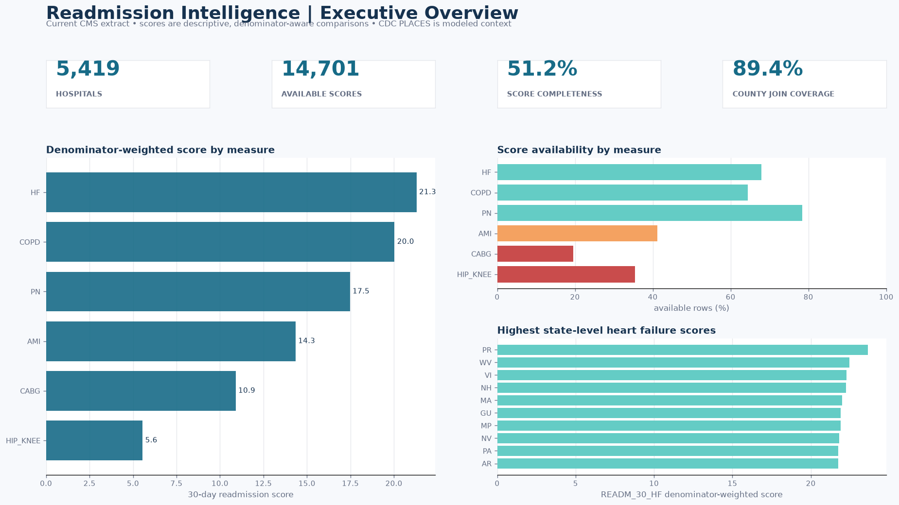
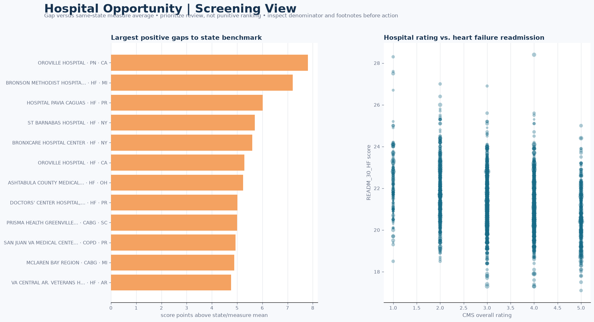

# US Hospital Readmission & Community Health Risk Intelligence

A reproducible analytics portfolio that combines current CMS hospital, readmission, and HCAHPS extracts with CDC PLACES county estimates. The project answers where readmission improvement screening may be useful, how states compare within a condition, what patient-experience context is available, and where data quality limits interpretation.

> **Decision framing:** this is a cross-sectional screening tool—not a hospital grading system, historical trend, or causal model. Readmission measures are condition-specific. CDC PLACES values are modeled county estimates, not patient-level prevalence.

## Dashboard previews





The PNGs and `outputs/reporting/executive_summary.md` are generated directly from SQLite with the tested Python reporting command; they are not manually edited screenshots.

## Problem statement

Hospital leaders need a transparent way to:

1. benchmark each 30-day readmission measure against comparable state peers;
2. identify high-gap hospital/measure combinations for review without hiding denominator or CMS footnote context;
3. compare patient-experience indicators without overstating repeated HCAHPS survey counts;
4. understand score and geographic-join completeness; and
5. add community-health context without implying causation.

## Analytical workflow

```text
CMS + CDC APIs → immutable raw snapshots → pandas cleaning/QA
→ SQLite star-style warehouse → portable SQL analysis
→ CSV exports + Python PNG/KPI report → Power BI-ready model specification
```

- Live CMS URLs are resolved from dataset IDs at runtime.
- `source_snapshot` preserves retrieval UTC, release metadata, byte size, raw row count, URL, and SHA-256.
- Facility IDs stay six-character text; CMS sentinel values become NULL, never zero.
- Ambiguous normalized county keys are surfaced in `qa_ambiguous_county_keys` and excluded from the joined view so hospital rows are not duplicated across county FIPS.
- Unmatched hospitals remain in `qa_unmatched_hospitals`; they are never silently dropped.

## Key findings from the included live snapshot

- **5,419 hospitals** and **28,740** readmission rows are represented; **14,701 (51.2%)** have scores.
- Availability varies materially by measure: pneumonia is **78.5%** complete, while CABG is **19.6%** complete.
- Denominator-weighted scores are shown **only by condition**; heart failure is **21.30**, COPD **20.04**, and pneumonia **17.47** in this extract. They are not combined into a clinically misleading all-condition score.
- Safe county join coverage is **89.4% (4,847/5,419 hospitals)** after excluding **544 unmatched hospitals** and **28 hospitals** on six ambiguous normalized county keys; all exceptions remain explicit QA outputs.
- The generated screening view flags **Oroville Hospital (CA), pneumonia**, at **7.80 points above** its state/measure mean. This is a review prompt, not a quality verdict; denominator, case mix, CMS comparison category, and footnotes must be inspected.

See [`docs/findings.md`](docs/findings.md) and the generated [`executive_summary.md`](outputs/reporting/executive_summary.md) for executed results.

## Business questions in SQL

[`sql/analysis.sql`](sql/analysis.sql) contains six independently runnable, portable SQLite statements covering:

1. **State benchmarking** — completeness and denominator-weighted score by state/measure with minimum evidence thresholds.
2. **Hospital opportunity** — score gap versus the same-state, same-measure mean with denominator and footnotes.
3. **Patient experience** — selected HCAHPS star measures with facility/sample context.
4. **Data completeness** — missing scores, denominator availability, footnotes, and small-case suppression.
5. **Geographic QA** — matched versus unmatched hospital coverage.
6. **Community context** — modeled PLACES estimates beside descriptive readmission observations, never causal claims.

## Exact reproduction

Requires Python 3.11+ from the project root.

```bash
# 1. Install runtime and test dependencies
python -m pip install -e ".[dev]"

# 2. Verify deterministic transformations, warehouse safeguards, DAX grain checks,
#    and reporting behavior
python -m pytest -q

# 3. Rebuild PNG dashboards and KPI/executive summaries from the included warehouse
python -m healthcare_intelligence.reporting \
  --db data/warehouse/healthcare.db \
  --output-dir outputs/reporting

# 4. Optional: refresh every live source and rebuild warehouse/CSV outputs
python -m healthcare_intelligence.pipeline --root .

# 5. Re-run the report after a live refresh
python -m healthcare_intelligence.reporting \
  --db data/warehouse/healthcare.db \
  --output-dir outputs/reporting
```

Compatible shell shortcuts: `make install`, `make test`, `make pipeline`, `make report`, and `make acceptance`.

### Generated report artifacts

- `outputs/reporting/executive_overview.png`
- `outputs/reporting/hospital_opportunity.png`
- `outputs/reporting/executive_summary.md`
- `outputs/reporting/kpis.json`

## Power BI handoff

A validated, source-controlled Power BI Project is included at [`powerbi/pbip/Healthcare Readmission Intelligence.pbip`](powerbi/pbip/Healthcare%20Readmission%20Intelligence.pbip). Its PBIR report and TMDL semantic model contain three data-bound pages: Executive Overview, Hospital Opportunity, and Data Quality / Provenance. The project passed structural validation with zero errors or warnings and was opened, refreshed, and screenshot-tested in Power BI Desktop. See [`powerbi/PBIP_README.md`](powerbi/PBIP_README.md) for the portable `ProjectRoot` parameter and refresh steps.


## Skills demonstrated

- **SQL:** CTEs, conditional aggregation, evidence thresholds, benchmark deltas, NULL-safe arithmetic, and portable SQLite.
- **Python:** pandas ETL, SQLite querying, Matplotlib reporting, CLI design, JSON/Markdown output, and test-driven development.
- **Data modeling:** hospital dimension, readmission/HCAHPS/county facts, grain-aware measures, safe geographic joins, and QA tables.
- **BI/communication:** executive KPI design, visual hierarchy, Power BI DAX/theme/wireframes, caveat-aware storytelling, and reproducible documentation.
- **Data engineering:** live API ingestion, provenance hashes, sentinel handling, stable text keys, CSV exports, and offline CI tests.

## Repository map

- `src/healthcare_intelligence/` — ingestion, cleaning, warehouse, analytics, findings, and reporting CLI
- `sql/` — logical schema and decision-oriented analysis
- `tests/` — deterministic transformation, collision, DAX-grain, and reporting tests
- `docs/` — architecture, methodology, dictionary, provenance, and executed findings
- `powerbi/` — validated PBIP/PBIR/TMDL project, model guide, DAX, theme, and wireframes
- `data/warehouse/healthcare.db` — locally generated SQLite analytical warehouse (Git-ignored)
- `outputs/` — compact QA/provenance summaries and generated report images; large fact exports are reproducible and Git-ignored

## Sources and guardrails

- CMS Hospital General Information (`xubh-q36u`)
- CMS Unplanned Hospital Visits (`632h-zaca`), restricted to six 30-day readmission measures
- CMS HCAHPS (`dgck-syfz`)
- CDC PLACES county data (`swc5-untb`), seven selected measures; age-adjusted prevalence preferred

Detailed limitations and field definitions are in [`docs/methodology.md`](docs/methodology.md) and [`docs/data_dictionary.md`](docs/data_dictionary.md).
